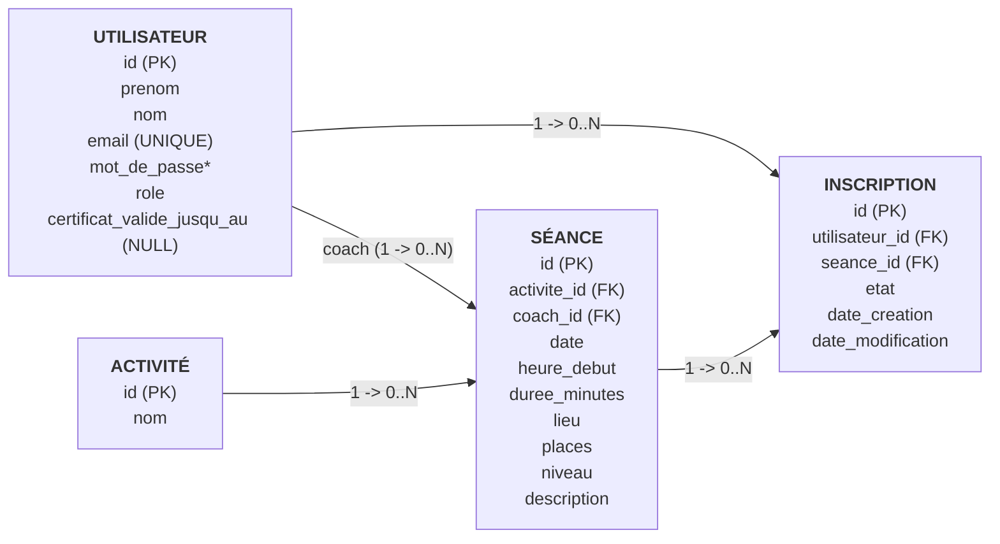

```mermaid
flowchart LR
    UTILISATEUR["<b>UTILISATEUR</b><br/>id (PK)<br/>prenom<br/>nom<br/>email (UNIQUE)<br/>mot_de_passe*<br/>role<br/>certificat_valide_jusqu_au (NULL)"]

    ACTIVITE["<b>ACTIVITÉ</b><br/>id (PK)<br/>nom"]

    SEANCE["<b>SÉANCE</b><br/>id (PK)<br/>activite_id (FK)<br/>coach_id (FK)<br/>date<br/>heure_debut<br/>duree_minutes<br/>lieu<br/>places<br/>niveau<br/>description"]

    INSCRIPTION["<b>INSCRIPTION</b><br/>id (PK)<br/>utilisateur_id (FK)<br/>seance_id (FK)<br/>etat<br/>date_creation<br/>date_modification"]

    UTILISATEUR -->|"coach (1 -> 0..N)"| SEANCE
    ACTIVITE -->|"1 -> 0..N"| SEANCE
    UTILISATEUR -->|"1 -> 0..N"| INSCRIPTION
    SEANCE -->|"1 -> 0..N"| INSCRIPTION
```